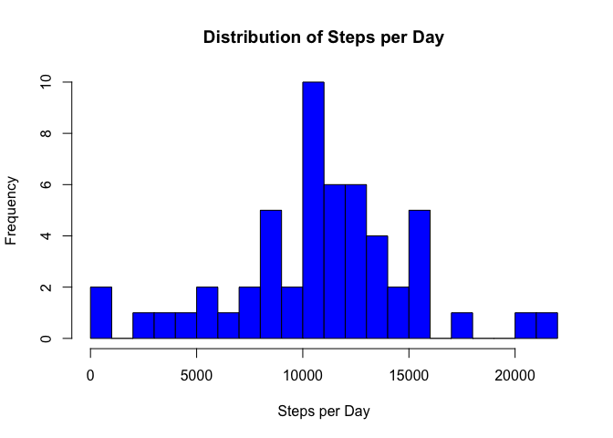
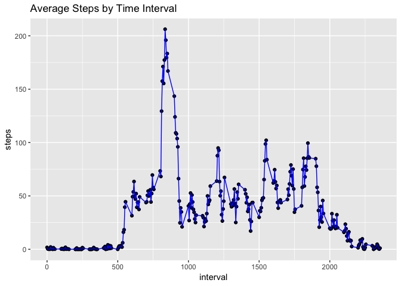
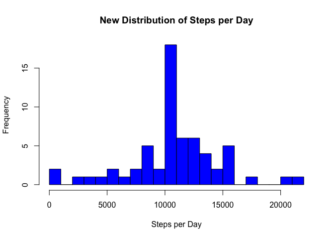
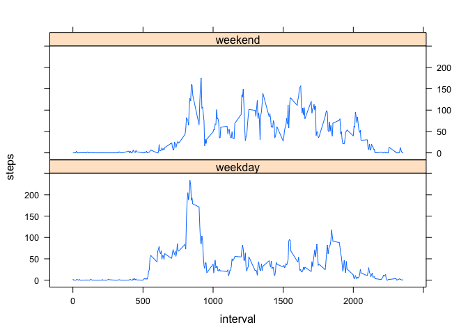

##Loading and preprocessing the data

The following is an analysis of activity monitoring data. The dataset includes two months of activity data in which each day is split into 5-minutes intervals. 

For each 5-minute interval, the number of steps taken by an individual is recorded. To read-in the data, and load a few R packages we'll need for our analysis, we made sure the dataset was unzipped and included in our working directory, then ran the following script:

```r
library(knitr)
library(ggplot2)
library(dplyr)
library(lattice)
activity <- read.csv("activity.csv", header=TRUE)
```
Let's take a look at the dataset using the head() function

```r
head(activity)
```

```
##   steps       date interval
## 1    NA 2012-10-01        0
## 2    NA 2012-10-01        5
## 3    NA 2012-10-01       10
## 4    NA 2012-10-01       15
## 5    NA 2012-10-01       20
## 6    NA 2012-10-01       25
```

It looks like we have a date column, so let's make sure R recognizes that data as date entries:

```r
activity$date <- as.Date(as.character(activity$date))
```
## What is mean total number of steps taken per day?

Now for the first step in our analysis. We would like to know the mean total number of steps taken per day. That means we need to total (sum) the steps taken on each day, then average (mean) the totals. Let's use the aggregate() function dy date to get the total number of steps for each day, then visualize that data in a histogram.


```r
activityByDate <- aggregate(activity[c("steps")], by=list(date=activity$date), sum)
```

```r
hist(activityByDate$steps, breaks = 25, xlab="Steps per Day", main = "Distribution of Steps per Day", col="blue")
```

<!-- -->

It looks like the most common values are just over 10,000 steps per day. Let's see if the average is around there too with median() and mean().


```r
meanStepsPerDay <- as.integer(mean(activityByDate$steps, na.rm=TRUE))
medianStepsPerDay <- median(activityByDate$steps, na.rm=TRUE)
```

The mean is 10766 and the median is 10765. 

##What is the average daily activity pattern?

Next, we'd like to get a picture of average (mean) activity over the course of the day, so we need to aggregate based on time interval, taking the average number of steps in each time interval throughout the day. We'll also create a line chart displaying the data.


```r
activity_na_rm <- activity[!is.na(activity$steps),] #remove NA values
activityByTime <- aggregate(activity_na_rm[c("steps")], by=list(interval=activity_na_rm$interval), mean, na.action=na.omit)
qplot(interval, steps, data=activityByTime, main="Average Steps by Time Interval") +geom_line(color="blue")
```

<!-- -->

You may have noticed some NA values when we showed a preview of the data, so we removed those for now to aggregate by time interval. 

You might be wondering which time interval tends to have the greatest number of steps (what's that big spike in the graph around interval 800?), so let's calculate the maximum average steps for the time periods in our dataset.


```r
maxStepsForInterval <- max(activityByTime$steps)
highestInterval <- activityByTime[activityByTime$steps==maxStepsForInterval,]
```
It looks like the highest average steps for one interval is 206.1698113 which is the average for interval 835

##Imputing missing values

We initially removed NA values so we could calculate the mean number of steps for each time interval, but now we'd like to address them. The total number of NA values for steps in our dataset is 2304. I think the best value we could use to replace them is the average number of steps for whatever time interval they fall in. Let's give that a shot by looping through our data, checking if values are NA, then replacing them based on their time interval.


```r
totalNAs <- sum(is.na(activity$steps))
activity_na_filled <- activity
for (row in 1:nrow(activity_na_filled)){
    interval <- activity_na_filled$interval[row]
    steps <- activity_na_filled$steps[row]
    if(is.na(steps)){
        activity_na_filled$steps[row] <- activityByTime[activityByTime$interval==interval,]$steps
    }
    else{activity_na_filled$steps[row] <- activity_na_filled$steps[row]}
}
```

Now that we've replaced NA values with averages for their time interval, lets make another histogram of average total steps per day with our modified dataset. 


```r
NewActivityByDate <- aggregate(activity_na_filled[c("steps")], by=list(date=activity_na_filled$date), sum)
#create histogram of data by date
hist(NewActivityByDate$steps, breaks = 25, xlab="Steps per Day", main = "New Distribution of Steps per Day", col="blue")
```

<!-- -->

It looks like the only difference is the number of values between 10,000 and 11,000. This makes sense because we added a bunch of additional average values and the mean total steps per day was 10,766 the last time we calculated it. Let's try calculating the mean and median of total steps per day for our new dataset.


```r
NewmeanStepsPerDay <- mean(NewActivityByDate$steps)
NewmedianStepsPerDay <- median(NewActivityByDate$steps)
```

The new mean is 1.0766189\times 10^{4} and the new median is 1.0766189\times 10^{4} so not much has changed.

## Are there differences in activity patterns between weekdays and weekends?

For our last round of analysis, we'd like to identify any differences between patterns of activity on weekends and weekdays. To do this, first we'll have to identify which of our dates fall on the weekends, and which fall on weekdays using the weekdays() function. Then we create a new factor variable and assign it either "weekend" or "weekday".


```r
activity <- mutate(activity, weekend=(weekdays(date)=="Saturday"| weekdays(date)=="Sunday"))
assign_weekend <- function(x){
    if(x==TRUE) x <- "weekend"
    else x <- "weekday"
}
for(i in 1:nrow(activity)){activity$weekend[i] <- assign_weekend(activity$weekend[i])}
activity$weekend <- as.factor(activity$weekend)
```

Finally, let's plot the averages of the two categories of activity (weekend and weekday) and look for differences in the daily activity.


```r
activity_na_rm <- activity[!is.na(activity$steps),] #remove NA values
activityByTime_day <- aggregate(activity_na_rm[c("steps")], by=list(interval=activity_na_rm$interval, weekend=activity_na_rm$weekend), mean, na.action=na.omit)
xyplot(steps~interval | weekend, data=activityByTime_day, layout=c(1,2), type="l")
```

<!-- -->

It looks like there's a sharp spike in the average number of steps around interval 800 which is less prominent on the weekend. The subjects of our data could have some extra walking in their commute to work. Significant activity also begins later on the weekend, so our subjects may sleep in on the weekends.
